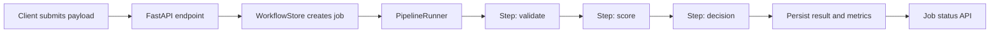

# Architecture

## Design Notes

- Pipelines are ordered step definitions that reference registered Python tasks.
- The runner records every step attempt so retries are visible during debugging.
- SQLite is used as a local stand-in for durable orchestration state.

